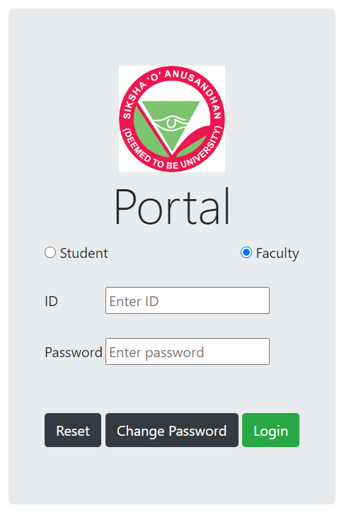
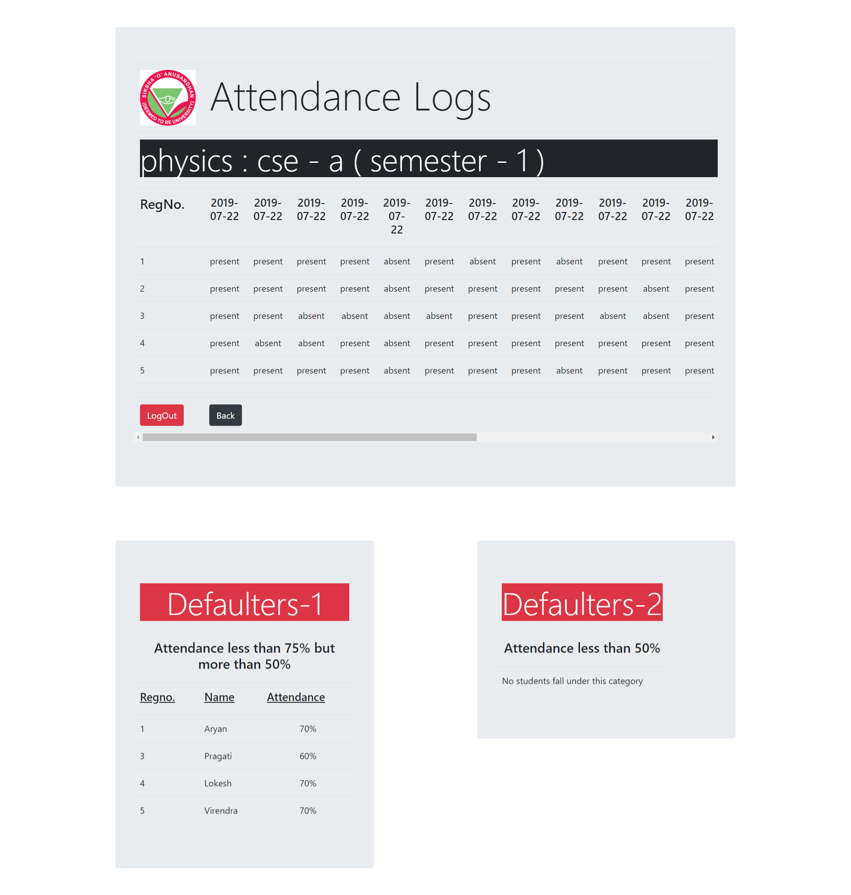
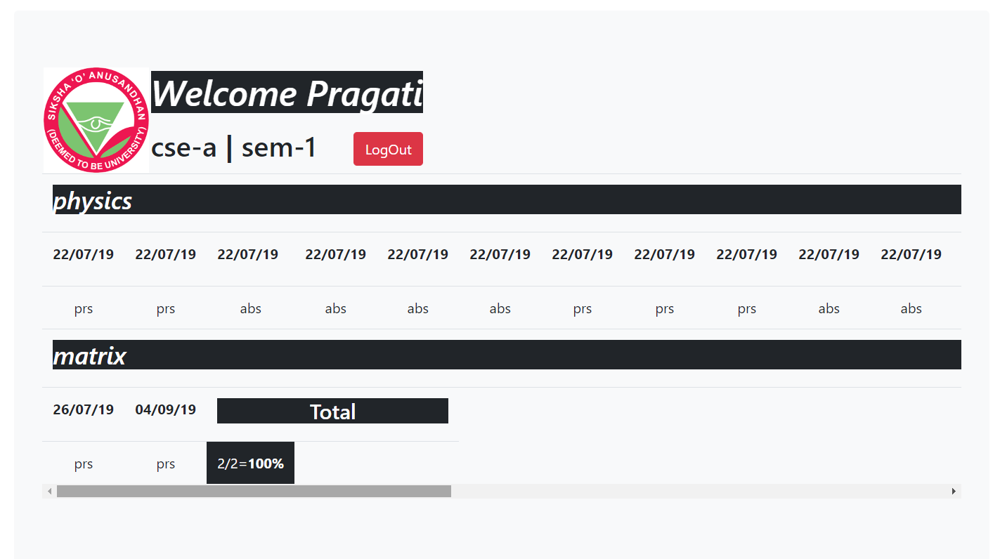

# Attendance-Manager

a web application featuring subject-wise attendance tracking for students and attendance management for teachers of an institution. 

# Screenshots
  
<b>Overview</b>

  

<b>Login portal</b>

  

<b>Homepage for teachers</b>

  

<b>Attendance Insertion by teachers</b>

  

<b>Attendance records of a class alongwith the list of defaulters (for teachers)</b>

  

<b>Subject wise attendance records (for student)</b>

  

